# [Solitaire](https://AlliGrass.github.io/project1_Solitaire/)

Here is the Solitaire Project that I spent countless hours working on!

# Project Overview

This project includes the foundation code for the card game Solitaire with simple CSS to set up the game. The aim is to collect the cards in ascending order in the top left collection bay, while using the limited space available to reveal the cards.

The game is fully functional, however, there are a few bugs that, while do not entirely impede on the gameplay, are still prevalent. This include dragging cards only displaying the 'targeted' card even if you are moving multiple of them. The most prevalent is the Play Again button, which doesnt work. This is (Most Likely) due to the fact that the functions purpose is to go through all the cards final collection bay and removes them one by one, however the list to retrieve the cards is not implemented correctly and therefore the cards cant be remove correctly. Furthermore, the general set up of the cards don't seem to be working, potentially due to how the function is being called.

# Development Process

Initially the choice was between creating Mastermind and Solitaire. This included creating mockups for their page designs and a general layout of the process to creating the project. Ultimately the decision to create Solitaire was based on the fact that it was more appealing, especially as I regularly play Solitaire, as well as having already made Mastermind before. Granted, it was a group assignment made in ARMlite.

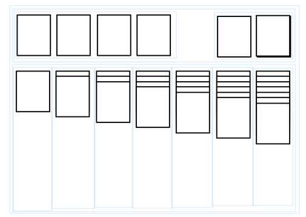
```
// Solitaire

/*
 
inital array of 52, refer to array when sorting cards (create working array for replayability)

sort using random num, remove card from array and update sort random to be the max length of working array

start by assign cards to working stacks that are immediately visible at bottom of screen, sort remainder (also random) within spare stack.

display back of card initially for all cards.

every row of working stacks is object (card value, visiblity boolean) // visibility boolean as class for array(?)

cycle through spare stack one by one, returning to start of deck when object (card value, visiblity boolean) ends


placeholder card(?) // CANNOT BE MOVED

troubleshooting: check that all arranged cards add up to 52 by checking lengths of arrays together


ascending cards check: check suit, then check value is ascending (reject or accept card into array) 
descending cards check: get first card, check if value and matching suit aligns (reject or accept card array merge)


functions :

- card visibility management
- confirm card can be placed
    - ascending final cards stacks (4 stack suits)
    - descending working cards stacks
Extra: 
- allow to remove card into working stacks again 
- allow autocomplete once all cards are revealed
    - function to check for all cards (within visibility management function)
        - if class, queryselectorall class and compare to amount in deck 52
    - display autocomplete button

- shorten card when not on top

*/
```
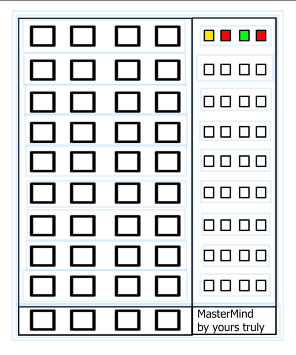
```
// Mastermind

/* 

randomise colours, assign them to numbers to be able to effectively random order + effective toggle

toggle through colours when press on button

submit button to enter code submission

evaluate input code. check for each pin in for loop (comparison array for multiples)

display comparison on right side of working space

if input code matches randomised initial code, reveal code at bottom of working space


functions: 
- toggle colours
- submit code
    - compare code to initial randomised code
        - display comparison result
*/
```

<!-- planning screenshots + plan text -->


When developing Solitaire the first step was to create the working space to place the cards. Once building initial 'look' of the page, the styling of the page was not touched for the remainder of the time that the project was working on in favour of implementing the core functions of the game.

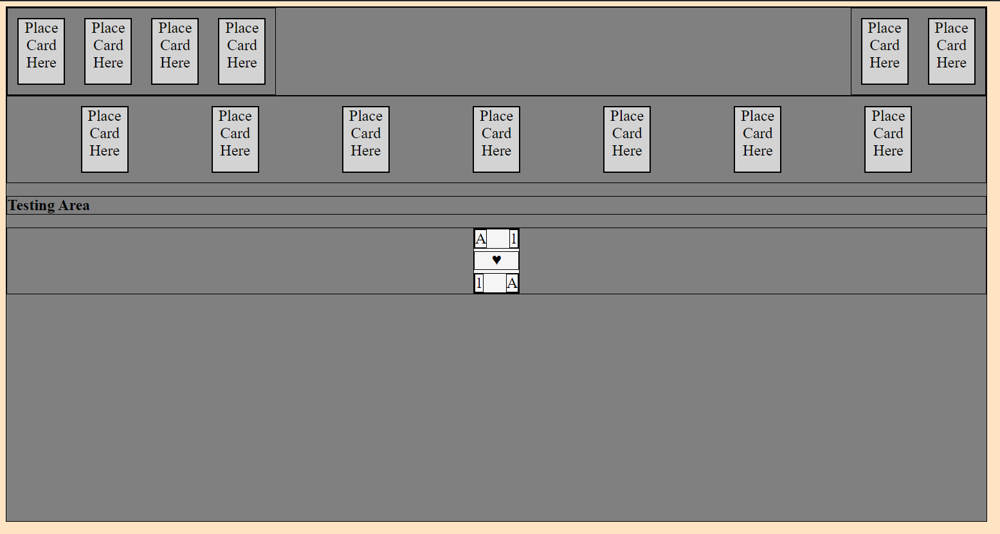
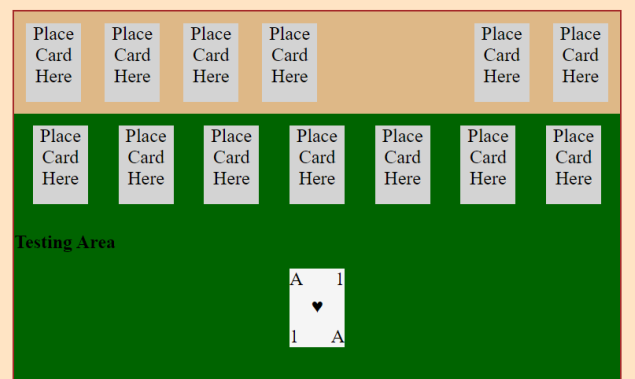

After the page was setup, creating (That's right, CREATING) the cards and placing them onto the page according was simple enough. This was because after shuffling the cards they were put into sets of arrays that corresponded with the location the stack of cards were supposed to go to. Essentially this meant there was an array like so:
- array: 1 card
- array: 2 cards
- array: 3 cards
- and so on...

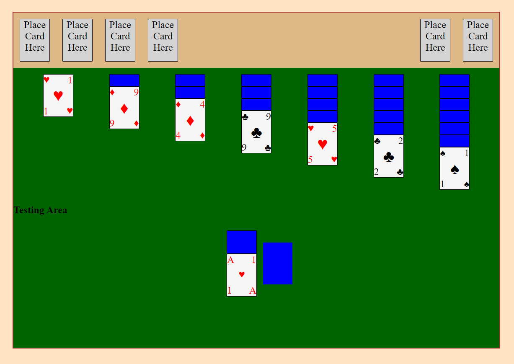

That wasn't the difficult part, and neither was changing the designs of the cards so they could stack neatly while only displaying the final card. At least when initialising the game that wasn't an issue. The problems came when the drag and drop feature was implemented into the game. Dragging one card to another and ensuring that the card could only be placed under certain conditions was straightforward and required some minor adjustments of how the card was initially built. This was easy to test by cycling through the remaining stack of cards and placing them onto the working table. How that card affected its environment was another thing entirely.

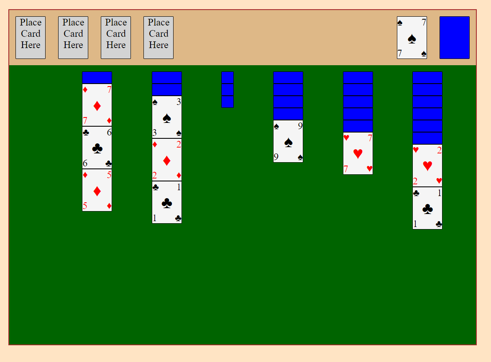

Up until this point the list elements that held the cards were being modified alongside arrays to represent the data, however to effectively implement any desire changes the continuous updating of the arrays needed to stop if the layout of the code were to be easily digestable, so after rewriting an entire function and effectively understanding how the drag and drop function worked, moving a card to a different column did exactly as it was supposed to.

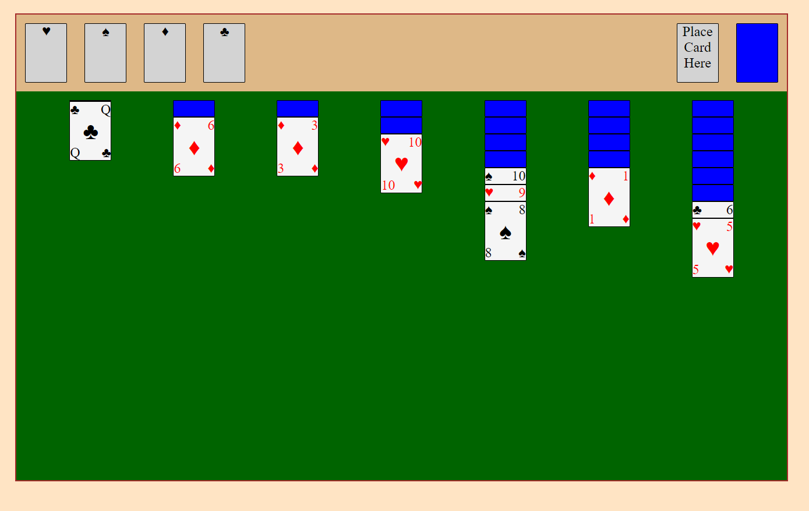

Next was to implement the winning condition for Solitaire so the cards could be placed into the final collection bay. Because the conditions to place a card in those stacks differed from the working table stacks a separate conditional needed to be created. Originally another drag and drop function was created alongside the initial one, however, when it was clear that only one drag and drop function would work it was quicker to simply include the conditioning into the first drag and drop function.

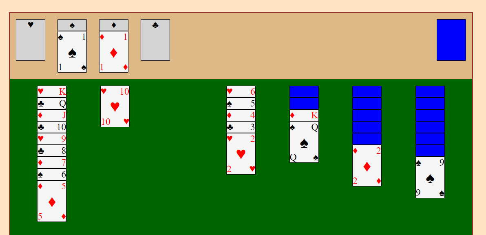

Now the game was *technically* complete. However there were some bugs that felt necessary to remedy. Up until this point when moving a group of cards, only the 'selected' card would move, which resulted in needing to move the group of cards one by one. While the image that displays when dragging a card across the screen only shows the 'selected' card, the entire group of cards will be dropped into the desired location.

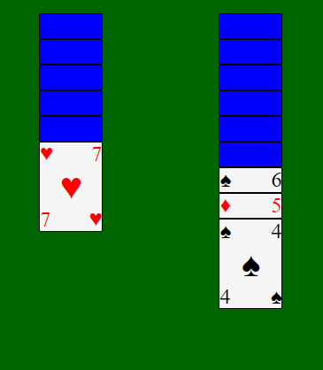
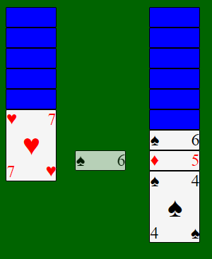
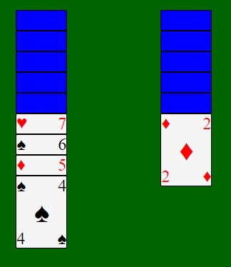


When all cards are placed in the final collection bay the page will dim and a popup will display, telling the user that they've won.

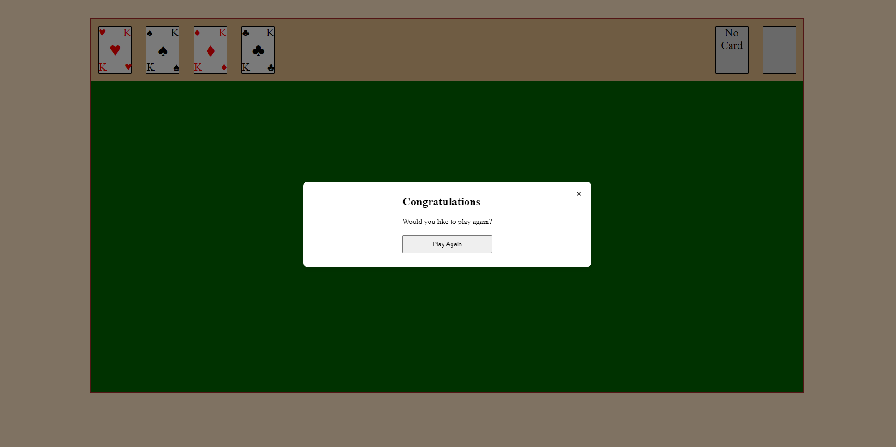

# Improvements
To further improve the experience, implementing a 'play again' button within the final popup window which correctly resets the working table as was originally planned for the popup window.

Several features could also be implemented such as a timer to display.

The most impactful improvement would be to refine the CSS of the page so that it looks cleaner and thematic.
